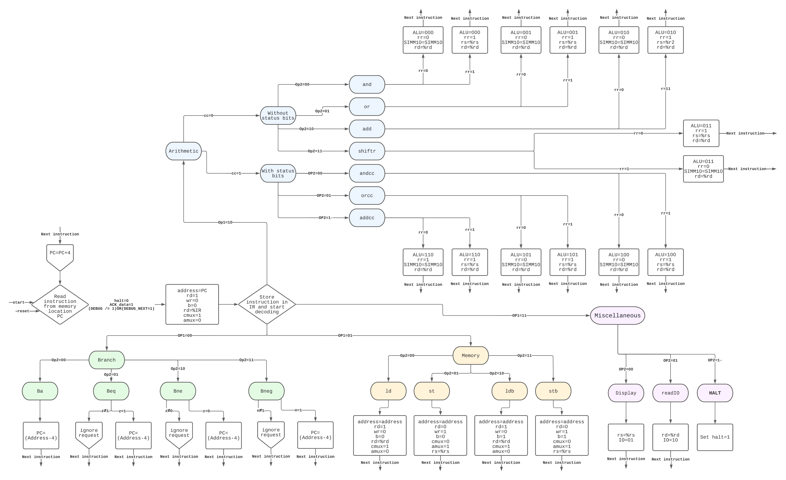

# JFEGS: a virtual processor for the DE1-SoC board
> Yet another revolutionary product that computes the Fibonacci sequence, designed by **J**oost Buursink, **F**abian Widlund, **E**mil Imhagen, **G**uus Branderhorst, and **S**tach Redeker.

This documentation file is part of the final project of Digital Hardware in module 5 of Electrical Engineering, University of Twente.

## Table of contents
  * [Introduction](#introduction)
  * [Instruction format](#instruction-format)
  * [Example application](#example-application)
  * [Parts of the processor](#parts-of-the-processor)
  * [Installation and usage](#installation-and-usage)
  * [Contributions overview](#contributions-overview)
  * [Future improvements](#future-improvements)
  * [Conclusion](#conclusion)
    
## Introduction
JFEGS is a virtual processor designed in VHDL for the Altera System-on-Chip (SoC) FPGA. The processor can be compiled using ModelSim and synthesized using Quartus. Various requirements were set. We discussed those in our [project plan](/ProjectPlan.pdf).

In this documentation file, we aim to elaborate on the workings of our virtual processor. This document can also serve as a starting point for people who wants to write programs for our system. First, we discuss the instruction format and our example application. After that, we dig deeper into our processor and give a brief overview of the workings of various important components. Lastly, we provide an installation guide and make recommendations for further improvements.


## Instruction format

The minimal instruction length to cover all the wanted instructions is 17 bits. In order to be able to convert the instructions into hexadecimal, we shall use an instruction length of 20 bits.


### Branch instructions
| Op1 | Op2 | Address (9 bits) | unused (7 bits) |
| :--  |:-- |:--  |:-- |
| 00 | XX | MMMMMMMMM | 0000000 |

| Instruction | Op2 |
| --- | --- |
| ba | 00 |
| beq | 01 |
| bne | 10 |
| bneg | 11 |

### Memory instructions
| Op1 | Op2 | Address (9 bits) | %rd/%rs (4 bits) | unused (3 bits)
| :--  |:-- |:--  |:-- |:-- |
| 01 | YY | MMMMMMMMM | RRRR | 000 |

| Instruction | Op2 |
| --- | --- |
| ld | 00 |
| st | 01 |
| ldb | 10 |
| stb | 11 |

### Arithmetic instructions

| Op1 | Op2 | cc | rr | %rs (4 bits) | %rd (4 bits) | unused (6 bits)
| :--  |:-- |:--  |:-- | :-- | :-- | :-- |
| 10 | ZZ | C | 1 | RRRR | RRRR | 000000 |

| Instruction | Op2 | cc |
| --- | --- | --- |
| and | 00 | 0 |
| or | 01 | 0 |
| add | 10 | 0 |
| shift | 11 | - |
| andcc | 00 | 1 |
| orcc | 01 | 1 |
| addcc | 10 | 1 |

### Miscellaneous instructions

#### `display`: displays a register value on the seven segments displays
| Op1 | Op2 | %rs (4 bits) | unused (12 bits) |
| :--  |:-- |:--  |:-- |
| 11 | 00 | RRRR | 000000000000 |

#### `readIO`: reads the current state of the switches and stores it in a register
| Op1 | Op2 | %rd (4 bits) | unused (12 bits) |
| :--  |:-- |:--  |:-- |
| 11 | 01 | RRRR | 000000000000 |

#### `halt`: stops the program
| Op1 | Op2 | unused 1s (16 bits) |
| :--  |:-- |:-- |
| 11 | 11 | 1111111111111111 |

## Example application
The processor is able to compute the Fibonacci sequence. The Fibonacci sequence can be defined in assembly as:
```assembly
.begin
.org 0
add %r0, %r0, %r1
add %r0, 1, %r2
fun: add %r1, %r2, %r3
add %r0, %r2, %r1
add %r0, %r3, %r2
ba fun
.end
```
However, to showcase the full potential of our product, we designed an extended Fibonacci application that uses the majority of the functionality of our instruction set. Also, observe that a two-address machine cannot handle instructions that use three registers. Hence, our application is rewritten such that it only uses a maximum of two registers per instruction.

The example program is able to compute the nth Fibonacci number, where n is inputted by the user using the onboard switches. The application can also halve the result, if the user requires so.
```assembly
readIO %r8					! let's start with getting user data
add %r9, 255, %r9				! store 011111111 in %r9
and %r8, %r9, %r9				! extract the wanted C value
st %r9, [C]					! store the wanted C value in memory
srl %r8, 8, %r8					! shift the read IO 8 places to extract the halving bit
st %r8, [H]					! and store the halving value

ld [H], %r4               			! loads whether or not we want half of the result
add %r2, 1, %r2
add %r6, 1, %r6 				! a 1 need for later
add %r7, 1, %r7					! a 1 need for later

start: ld [C], %r5				! keeps track of the iterations
addcc %r5, -1, %r5
st %r5, [C]
bneg ending

and %r0, %r3, %r3				! clear reg3
add %r2, %r3, %r3				! adds %r1 to %r2 and stores in %r3
add %r1, %r3, %r3				! ^^^^
and %r0, %r1, %r1				! clear reg1
add %r2, %r1, %r1				! stores %r2 in %r1
and %r0, %r2, %r2				! clear reg2
add %r3, %r2, %r2       			! %r2 will contain the result
ba start

ending: orcc %r4, %r0, %r0			! check if we want the full result
be display
andcc %r4, %r6, %r6	 			! check if we want half of the result
bne halving     

halving: and %r2, %r7, %r7			! check if the last bit is a 1 (then the number is odd)
srl %r2, 1, %r2					! divide the result by 2 using a shift right
add %r7, %r2, %r2				! and add the 1 back if it was odd

display: display %r2
halt             				! display the result

C: 0                    			! how many times we should run the function
H: 0                     			! H = 0, not halve; H = 1, halve 
```

## Parts of the processor
This chapter gives a brief summary of different processor parts.

### Controller
The controller is the brain of our processor. It is able to perform the fetch-decode-execute cycle. It fetches the instructions from the memory, stores them in the instruction register, and from there, interprets them (decode). After that, the controller sends signals to the other systems in the processor to make sure that the operation gets correctly executed.

We opted for a finite state machine (FSM) over microstore because a FSM is easier and more elegant to implement for smaller instruction sets. Although mircostore allows for a more generalizable instruction set, a FSM should suffice in our case.



### Datapath and dataflow
There is a significant number of signals that transport data between processes. To avoid confusion, we try to give the signals the same name in every process.
[This table contains the signals that are used to communicate between processes.](/Signals.pdf)

#### Registers
| Register | Function |
| :-- | :-- |
| Register 0-13 | general purpose |
| Register 14 | program counter |
| Register 15 | instruction register | 

#### ALU and status bits

The ALU receieves `F2F1F0` from the controller in order to communicate about the wanted operation.
| F2 | F1 | F0 | Operation |
| :-- | :-- | :-- | :-- |
| 0 | 0 | 0 | AND |
| 0 | 0 | 1 | OR | 
| 0 | 1 | 0 | ADD |
| 0 | 1 | 1 | Shift right |
| 1 | 0 | 0 | ANDcc |
| 1 | 0 | 1 | ORcc |
| 1 | 1 | 0 | ANDcc |
| 1 | 1 | 1 | nothing (default value) |

The ALU outputs the result, and sets the status bits (n/z/v/c) if required.

#### `ACK_data` 

### Memory
We designed the memory based on the von Neumann architecture. The memory is made up of a 2D array consisting of 128 blocks, where each block is made up of 4 bytes. This results in a word size of 32 bits. Hence, a complete instruction can reside in one memory block. The memory is synthesized on the FPGA. It will hence be built using flip-flops. 

4 input signals are picked up by the memory. These inputs are `rd`, `wr`, `b`, and `address`. We also use a `data-in` and data-out `signal`. `rd` and `wr` tell the memory if we want to read or write respectively. These are used in combination with `b`, which tells us if we want to address bytes separately. The memory is able to perform 4 different operations. These operations are:

| rd | wr | b | Operation
| :-- | :-- | :-- | :-- |
| 1 | | 1 | store the selected memory address in the 8 least significant bits of `data-out` |
| | 1 | 1 | store the 8 least significant bits of data-in in memory at the selected address |
| 1 | | 0 | store an entire word from memory in `data-out` |
| | 1 | 0 | store `data-in` in 4 sequential bytes in memory |


### IO
The DE1-SoC board has 10 switches, 10 LEDs, 4 momentary push buttons, and 6 seven segments displays. We connected the following functions to the onboard inputs:
| Input | Function |
| :-- | :-- |
| Button 0 | reset |
| Button 1 | next instruction (used during debugging) |
| Button 2 | load an address (used during debugging) |
| Button 3 | unused |
| Switch 0-8 | input variables for the program (during normal operation), input memory address (during debugging) |
| Switch 9 | activate debugging mode |

And we connected the following functions to the onboard outputs:
| Output | Function |
| :-- | :-- | 
| LED 0 | c |
| LED 1 | v |
| LED 2 | z |
| LED 3 | n |
| LED 4 | rd |
| LED 5 | wr |
| LED 6-9 | unused |
| seven segment displays | output of the application (during operation), memory contents (during debugging) |


### Debugging
In the requirements, we stated that we should implement a debug mode. If the debug mode is active, the user should be able to step through the program one line at a time. Also, the user shall be able to load the contents of a memory address and display it using the seven-segment displays on the FPGA.

Observe that we can pause a program by stopping the controller in its fetch-decode-execute cycle. To accomplish this, we replaced
```VHDL
ELSIF (rising_edge(clk)) THEN 
```
with
```VHDL
ELSIF (rising_edge(clk)) AND (halt = '0') AND (ACK_data = '1') AND ((DEBUG /= '1') OR (DEBUG_NEXT = '1')) THEN 
```
It can be seen that we added two new signals. `DEBUG` is 1 if the debug switch is turned on. `DEBUG_NEXT` is 1 for exactly 1 clock cycle when a user presses the 'next line' button.

#### `debugging_facilitators`
One might wonder how we set `DEBUG_NEXT` to 1 for exactly 1 clock cycle when the user presses the button. The `DEBUG_NEXT` signal shall be an asynchronous input to the controller. Hence, we opted for a dedicated process `debugging_faciliators` that handles this input and transforms it in the required signal. `debugging_faciliators` also produces the signals for the `rd` and `wr` LEDs.

#### `debugging_display`
`debugging_display` sends the required signals to the displays and LEDs.

## Installation and usage
Use the following files for compilation in ModelSim:
```
File 1
File 2
...
File n
```
Use the following files for synthesis in Quartus:
```
File 1
File 2
...
File n
```

## Synthesis results

## Contributions overview
| Member | Work |
| :-- | :-- |
| Joost Buursink | |
| Fabian Widlund | | 
| Emil Imhagen | |
| Guus Branderhorst | |
| Stach Redeker| |

## Future improvements

## Conclusion
During this project, we developed a virtual processor that can be synthesized on the DE1-SoC board. The virtual processor is designed using VHDL and ships with an application that is able to compute the Fibonacci sequence.

## References and acknowledgements
